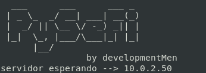
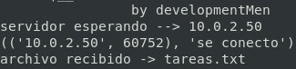

#### `PySeFi` es una simple aplicacion escrita en python que mediante sockets envia un archivo de **imagen, video, audio, texto o varios archivos en un comprimido** a otra computadora de la misma red mediante la ip y sin *necesidad de conexion a internet*.

# `en sistemas Linux es recomendable primero editar el archivo */etc/hosts* para poder ver la ip sin problema`

## Como se usa?
se inicia el *socket server* desde la computadora que quiere **recibir el archivo**
> python pySeFi_Server.py

desde la computadora encargada de **enviar el archivo**
> python pySeFi_Server [la ip destino] [el archivo]

## recomendacion para usuarios **Linux**
editar el archivo /etc/hosts para poder usar *PySeFi* sin necesidad de la ip

### inicia servidor

en este caso fue probado en maquina virtual por lo que la ip es diferente

### editar /etc/hosts

### enviando...

### todo salio bien

